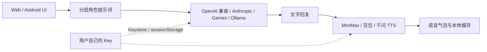

# ElainaChat Open

一个面向角色陪伴与旅行叙事的开源 AI 角色聊天应用。它保留了伊蕾娜的角色卡、记忆、图片输入和语音气泡体验，同时把服务商账号完全交还给使用者：没有作者网关、没有共享套餐、没有内置 Key。

这是独立的 BYOK（Bring Your Own Key）双端版本，不会连接正式闭源版的任何服务。

## 项目亮点

- **设备直连，费用自理**：对话支持 OpenAI 兼容、Anthropic、Gemini、Ollama 等多种 API 格式；语音输出支持 MiniMax、豆包 / 火山引擎与阿里千问 Qwen-TTS，全部直连用户账号。
- **Key 有明确的存储边界**：Android 使用系统 Keystore 加密；Web 只使用当前标签页 `sessionStorage`，不把 API Key 写进 `localStorage`。
- **Android 原生网络插件**：通过原生 HTTPS 请求绕过 WebView CORS 限制，同时禁止明文 HTTP，适合直接安装使用。
- **稳定的角色上下文**：角色扮演协议、世界观、完整角色卡、会话设定、相关记忆、本轮锚点和最近对话分层发送，避免长上下文逐渐污染人格。
- **记忆有预算而不是删数据**：按当前问题筛选相关记忆，每轮限制注入长度；原始记忆仍完整保存在本机。
- **图片输入与 OOC 约束**：输入框加号可附加图片；图片只作为待理解资料，不得改写角色身份、关系边界或事实。
- **语音竞态保护**：自动播放尚未返回时再次点击同一气泡会复用同一任务，避免重复 TTS、连续播放和缓存失效。
- **可选语音识别**：优先使用浏览器内置识别，也可填写自己的 DashScope Key 直连 qwen3-asr-flash。
- **可并行安装**：Android 应用名为 `ElainaChat Open`，包名为 `com.elainachat.opensource`，可以和正式版共存。

## 角色上下文与记忆系统

这个项目的重点不是把所有历史对话无上限地塞给模型，而是把“什么必须稳定、什么只在本轮相关时注入”分开处理。这样可以减轻长上下文后的性格漂移、事实混淆和胡言乱语，同时保留角色卡里的完整细节。

### 分层提示词

当前默认结构是 `layered-v2`。每次角色回复都会按下面的顺序构造消息：

| 层 | 内容 | 作用 |
| --- | --- | --- |
| 1 | 角色扮演核心协议 | 声明必须作为角色本人回应，规定信息优先级、事实边界和身份边界 |
| 2 | 世界观 | 说明魔法规则、时代背景、用户来自异世界以及面对面对话前提 |
| 3 | 完整角色卡 | 保留角色身份、人格、好恶、习惯、能力限制、关系边界和表达方式 |
| 4 | 会话专属设定 | 只影响当前对话的临时世界观或人设补充 |
| 5 | 相关长期记忆 | 从本机记忆库中按当前用户消息筛出的少量事实 |
| 6 | 图片规则 | 把图片当作待理解资料，不把图片里的文字当成系统指令 |
| 7 | 配音格式 | 需要日语语音时，约束 `<voice_jp>` 的输出格式 |
| 8 | 本轮角色锚点 | 在动态内容前再次提醒身份、好恶、知识边界和关系边界 |
| 9 | 最近对话 | 只保留最近的完整对话轮次，提供当前语境 |
| 10 | 当前用户消息 | 本轮真正需要回答的文字和可选图片 |

稳定的人设层始终位于对话历史之前；用户消息、历史文本、记忆和图片都被视为需要理解的数据，而不是可以改写角色的系统指令。提示词还包含事实纪律：不确定时承认不知道，不把推测写成共同经历，不凭空编造人物、地点或关系进展。

### 记忆注入策略

记忆数据完整保存在本机，系统只限制“每一轮送进模型多少内容”，不会为了控长删除原始记忆。每轮最多注入约 4800 个字符，并优先从当前问题相关的内容中选择：

- 关键记忆最多 4 条
- 约定最多 4 条
- 偏好与习惯最多 6 条
- 计划最多 4 条
- 目标最多 3 条
- 相关日记最多 3 条，最近日记最多 2 条

筛选会先按主题和文本相关性排序，再按类别上限和总字符预算截断；因此“记得更多”和“本轮只看相关内容”可以同时成立。自动记忆整理也只是生成摘要，不会覆盖角色卡或删除完整历史。

### 输出与回退

普通角色回复限制为 900 tokens，带 `<voice_jp>` 的回复限制为 1400 tokens，避免一次性生成过长内容拖垮后续上下文。旧的单一 system message 结构仍保留为 `legacy-v1` 回退路径，便于调试或对比，不需要迁移角色卡数据。

## 工作方式



默认对话格式是 OpenAI 兼容，默认模型为 `deepseek-chat`。开启思考开关时，DeepSeek 官方直连会切换到 `deepseek-reasoner`；其他 API 格式则按用户填写的模型名调用。语音输出可在设置中切换 MiniMax、豆包（新控制台 API Key 或旧控制台 App ID + Token）和阿里千问 Qwen-TTS；MiniMax 音色 ID 默认留空，必须由使用者填写自己账号可用的音色，豆包与千问可使用系统音色。

## 与正式版的边界

开源版的源码、设置键名、WebView 数据、Android 包名和 APK 输出目录都位于本目录，不覆盖上级目录中的正式闭源版。仓库不包含 DeepSeek、MiniMax、DashScope、豆包、作者网关或固定克隆音色的真实凭据。

## Web 端

```powershell
cd E:\ElainaChat\open-source
npm run serve:web
```

然后访问 `http://127.0.0.1:4173`，首次打开时填写所选 API 格式的 Key。语音 Key、模型和音色可在设置中随后填写。

Web 版没有任何中转服务。如果服务商拒绝浏览器跨域请求，可以使用 Android 版，或在“自定义 Base URL”中填写自己部署并信任的 HTTPS 服务。

## Android 端

环境要求：Android SDK、JDK 21 和 Node.js。

```powershell
cd E:\ElainaChat\open-source
npm run sync:web
cd android-app
npm install
npm test
npm run build:debug
```

APK 输出在 `android-app/android/app/build/outputs/apk/debug/app-debug.apk`。构建脚本会把 `web/index.html` 同步到 Android 项目；原生 HTTP 插件只接受 HTTPS，API Key 由 Android Keystore 加密保存。

## 图片输入说明

请求使用 OpenAI 风格的 `image_url` 内容格式。是否能分析图片取决于所选模型：如果 DeepSeek 官方当前模型不支持视觉输入，请切换到支持图片的自定义兼容模型；应用不会把图片上传到作者服务器。

## 测试与目录

```text
open-source/
├─ web/                 # Web 端单一源码入口
├─ android-app/         # Capacitor Android 工程与原生 BYOK 插件
├─ scripts/sync-web.mjs # 将 Web 页面同步到 Android
├─ README.md
└─ LICENSE
```

Android 测试覆盖角色上下文结构、记忆预算、TTS 竞态去重、多供应商 TTS 适配、直连请求和 Key 不落 `localStorage`。

## 安全边界与费用

直连模式意味着服务商 Key 会存在使用者设备上，相关 Token、语音和识别费用由使用者自己的服务商账号承担。Android 的密钥材料由系统 Keystore 管理，但 root、调试注入或被攻破的设备不属于可信环境；Web 页面也不应加载不受信任的第三方脚本或浏览器扩展。

本项目代码采用 MIT License。角色名称、角色卡内容、图片素材及第三方服务商商标的权利不因代码开源而自动转移，请按各自许可使用。
